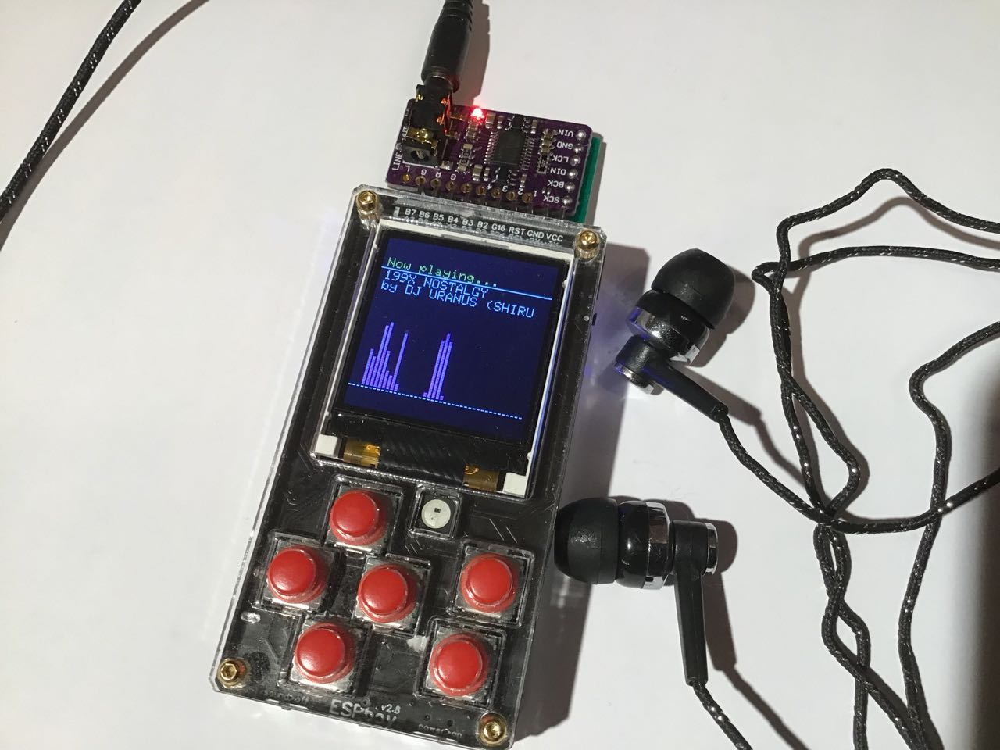
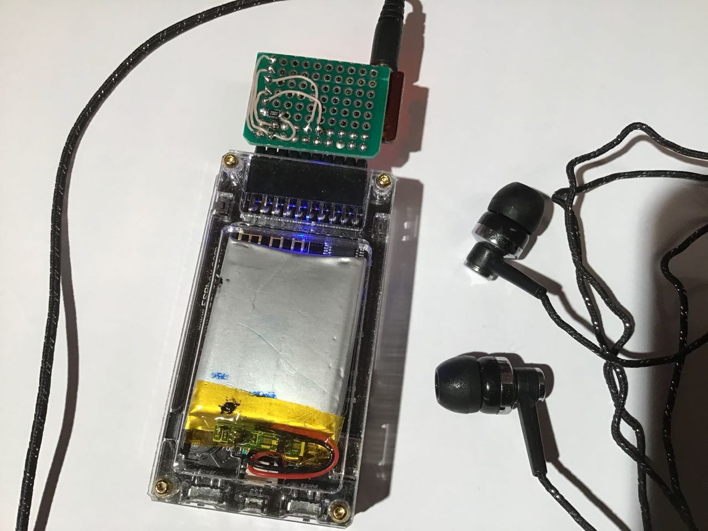
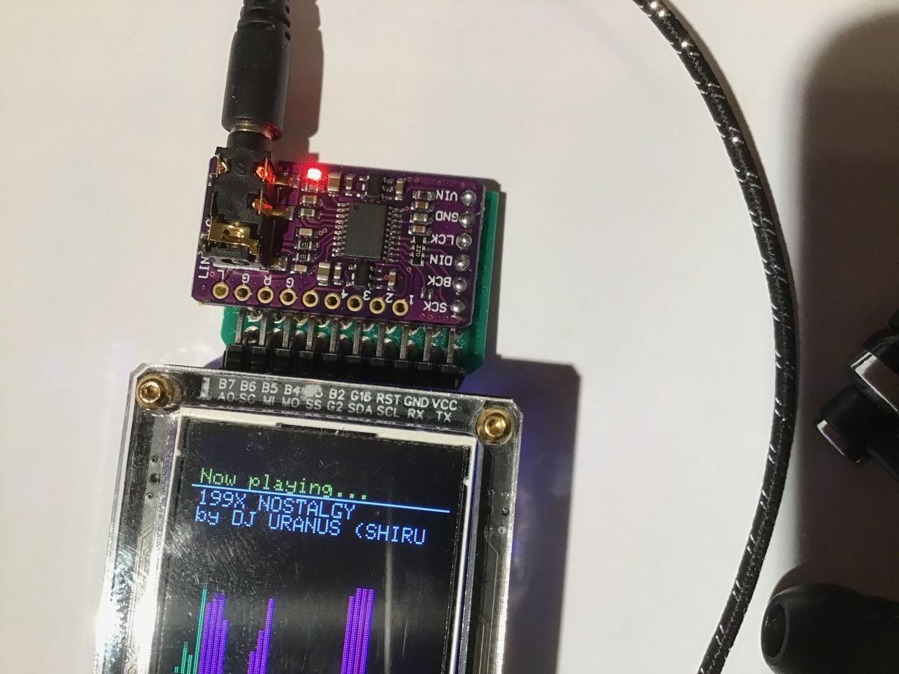
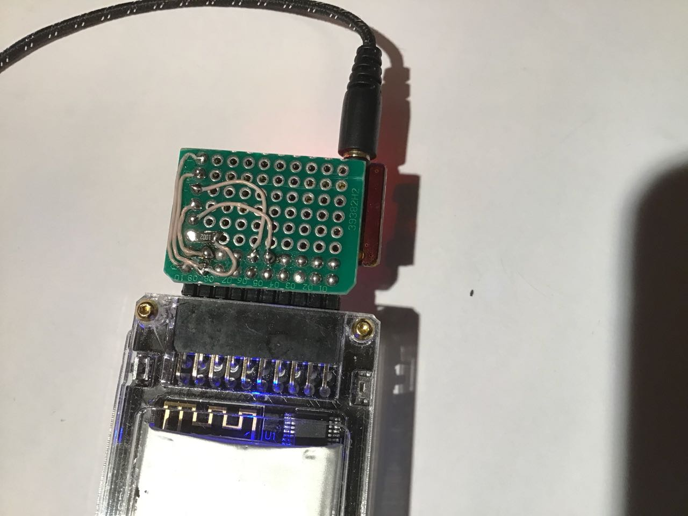

#ESPboy_PT3Play 
ESPboy PT3 - AY-3-8910 music player, using standard speaker or additional ESPboy MCP5102 I2S DAC module for better sound quality

[demo video](https://www.youtube.com/watch?v=zYsDjjNx5j0)

initial version by Shiru

<shiru@mail.ru>

<https://www.patreon.com/shiru8bit>

This is a PT3 format chiptune music player. The format is kind of standard de-facto for AY-3-8910 chiptune music on Russian ZX Spectrum clones. About ten thousands songs has been made since mid-90s when it was first introduced.

The program emulates AY sound chip and plays PT3 files loaded into the SPIFFS. The sound is output through the sigma-delta modulation based DAC via the built-in speaker. It also supports i2s stereo DAC if connected (change define in the sketch, no run-time option to switch between outputs at the moment).

Programming lesson learned: do not use sigma-delta while accessing SPIFFS, it crashes the device (i.e. disable sigma-delta while accessing files).

I have included some of my own music to test it out. See zxtunes.com or the TrSongs archive to get much more.

You can buy this DAC module ready-made or make it yourself.

## 1. Buy I2S PCM5102 DAC module

-  PCM5102 module [link to buy](https://aliexpress.ru/wholesale?catId=&SearchText=PCM5102)

## 2. Connect PCM5102 DAC module -> ESPboy I2S bus

- Vin -> VCC
- GND -> GND
- LCK -> G2 (GPIO2 / D4 / I2S0-WS)
- DIN -> RX (I2S0-DATA)
- BCK -> SS (CS / GPIO15/ D8 / I2S0-BCK)
- SCK -> 10k resistor -> GND

## 3. Upload this firmware

NOTE: Before compilation, set Arduino IDE settings

-  Board:  ESP8266 WeMos D1 mini
-  !CPU frequency: 80Mhz

NOTE: After compilation [upload music files to SPIFFS](https://randomnerdtutorials.com/install-esp8266-filesystem-uploader-arduino-ide/)

## 4. Useful links

- [Buy ESPboy](https://www.tindie.com/products/23910/)
- [DIY ESPboy](https://easyeda.com/ESPboy)
- [Main Web site](https://www.espboy.com)
- [YouTube channel](https://www.youtube.com/c/ESPboy)
- [Community](https://community.espboy.com)
- [Discord chat](https://discord.gg/kXfDQpX)
- [Twitter](https://twitter.com/ESPboy_edu)
- [Software](https://github.com/ESPboy-edu)
- [Contact: espboy.edu@gmail.com](mailto:espboy.edu@gmail.com)

